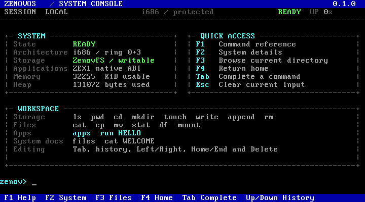

# ZenovOS 0.1.0

ZenovOS is a compact 32-bit x86 operating system built with Zenov, assembler
and freestanding C++17. It boots from a deterministic FAT12 image, mounts a
separate writable ATA data volume and executes validated native applications in
ring 3.

## System console

The home screen presents current system state, keyboard shortcuts and common
storage/application actions. The header reports execution mode, readiness and
uptime. Boot diagnostics remain on COM1 instead of filling the workspace.



The image embeds the real framebuffer capture produced by the verified QEMU
run. It is not a mockup.

Console controls:

- `F1` opens the command reference;
- `F2` opens system details;
- `F3` lists the current persistent directory;
- `F4` returns to the home dashboard;
- `Tab` completes command names;
- `Esc` clears the current input;
- Left/Right, Home/End, Backspace and Delete edit the command line;
- Up/Down recalls the last 16 commands while preserving the unfinished draft.

Three restrained VGA themes are available:

```text
theme midnight
theme graphite
theme amber
```

## Download

The GitHub Release contains installation-related files only:

- `ZenovOS-0.1.0-x86.zip` — recommended package containing both required images, the guide and QEMU launchers for Linux/macOS and Windows;
- `ZenovOS-0.1.0-x86.img` — raw 1.44 MiB bootable FAT12 system image;
- `INSTALL.txt` — QEMU, VirtualBox, storage, applications and controls reference;
- `SHA256SUMS.txt` — public download verification.

The ZIP contains a second file, `ZenovOS-0.1.0-data.img`, which is the writable
16 MiB ATA/ZenovFS volume. Keep both images together. User files under `/data`
survive a reboot.

[Open the ZenovOS 0.1.0 release](https://github.com/xemoll/zenov-os/releases/tag/v0.1.0)

ZenovOS still boots directly from the FAT12 image. Version 0.1.0 does not yet
install itself to a physical hard disk.

## Persistent storage

The protected-mode kernel includes a primary-master ATA PIO block driver and
mounts `ZenovFS1` at `/data`. The generated documents remain available as a
separate read-only system surface.

```text
mount
df
pwd
cd <path>
ls [path]
mkdir <path>
touch <file>
write <file> <text>
append <file> <text>
cat <file>
stat <path>
cp <source> <destination>
mv <source> <destination>
rm <path>
```

ZenovFS1 currently provides 128 entries and fixed 64 KiB file slots. Every file
read verifies an FNV-1a checksum. Directories must be empty before removal.
The format is deliberately bounded and is not presented as a replacement for a
future general-purpose FAT16/ext-style filesystem.

See [`docs/ZENOVFS.md`](docs/ZENOVFS.md) for the disk format and limitations.

## Native applications

ZenovOS now has a native executable format named `ZEX1`:

- 32-bit i686 code;
- isolated 1 MiB ring-3 segment;
- TSS-backed ring 3 to ring 0 transitions;
- user-callable `INT 0x80` syscall gate;
- validated header, bounds and payload checksum;
- deterministic host packer;
- independent application build outside the kernel.

The included application is stored at `/data/apps/hello.zex` and launched with:

```text
apps
run HELLO
```

The initial ABI provides process exit, console output and PIT tick access. It
runs one foreground application at a time. Paging, multitasking, dynamic
linking and file descriptors are not part of ZEX1 yet.

See [`docs/ZEX_ABI.md`](docs/ZEX_ABI.md) for the exact container and syscall
contract.

### About `.exe`

ZenovOS does **not** currently run arbitrary `.exe` files. ZEX is a native
ZenovOS format, not a renamed Windows or DOS executable.

- Windows `.exe` files use PE/PE32+ and depend on Win32/NT APIs.
- DOS `.EXE` files use MZ, 16-bit segmented execution and DOS interrupt services.

Both require separate compatibility layers. Unsupported files are rejected
rather than executed in kernel mode.

## Current kernel surface

- BIOS/FAT12 boot path;
- E820 memory discovery and A20 setup;
- 32-bit i686 protected mode;
- ring-0 and ring-3 GDT descriptors plus TSS;
- IDT exception handling, panic diagnostics and `INT 0x80` syscall gate;
- remapped PIC, 100 Hz PIT and IRQ-driven PS/2 keyboard;
- VGA workspace mirrored to COM1;
- full single-line editing, Tab completion and function-key navigation;
- bump-allocated kernel heap;
- ATA PIO block device;
- writable persistent ZenovFS1 volume;
- read-only VFS documents generated from `kernel/main.zv`;
- native ZEX1 application loader;
- native C++17 Zenov stage0 compiler and deterministic image builders;
- no Python source or runtime dependency.

## Commands

```text
home help info system status devices disk mount df ver version uname
cpu mem memmap uptime ticks date time echo calc theme color
pwd cd ls dir files cat open view mkdir touch write append
rm del cp copy mv ren stat apps run history bootlog clear cls
reboot halt shutdown panic about license
```

## Verified build

GitHub Actions performs a two-boot QEMU test on the same runtime data disk:

1. boot and mount ZenovFS1;
2. write `PERSIST.TXT`;
3. load and execute `hello.zex` in ring 3;
4. return through the exit syscall;
5. stop QEMU;
6. start a second QEMU process with the same disk;
7. read the file back and verify its checksum.

Required serial evidence:

```text
ZENOVOS_BOOT_OK
ZENOVFS_MOUNT_OK
ZENOVOS_UI_READY
WRITE_OK
HELLO_ZEX_OK
APP_EXIT code=0
PERSISTENCE_OK
zenov>
```

CI also rejects a false post-exit load error, checks UTF-8 source integrity,
absence of Python, Zenov parser failure cases, FAT12 structure, undefined ELF
symbols, ZEX header/checksum validation, a byte-identical system/data/application
rebuild and two byte-identical installation-package builds.

## Build from source

Required tools: GNU Make, GNU `as`/`ld`/`objcopy`, a C++17 compiler,
`qemu-system-i386`, `zip` and `unzip`.

```bash
make clean check
make qemu
make test
bash tools/package_release.sh build/zenov-os.img build/zenov-data.img dist package
```

Developer outputs remain CI artifacts and are not added as separate public
Release downloads:

```text
build/BOOT.BIN
build/KERNEL.BIN
build/kernel.elf
build/kernel.map
build/zenov-os.img
build/zenov-data.img
build/HELLO.ZEX
build/hello-user.elf
build/build-manifest.json
build/qemu/serial.log
build/qemu/screenshot.ppm
```

## Zenov source contract

`kernel/main.zv` defines the product name, version, prompt, boot messages,
project commands and read-only system documents. The native stage0 compiler
rejects a system version other than `0.1.0`.

Supported calls:

```text
system_name(string)
system_version(string)
shell_prompt(string)
theme(foreground, background)
boot_message(string)
shell_command(name, response)
vfs_file(name, content)
```

See [`docs/ARCHITECTURE.md`](docs/ARCHITECTURE.md) for the implementation split.

## License

Original ZenovOS code is BSD-2-Clause. FAT12 loader lineage and the retained
x16-PRos MIT notice are documented in `THIRD_PARTY.md`.
